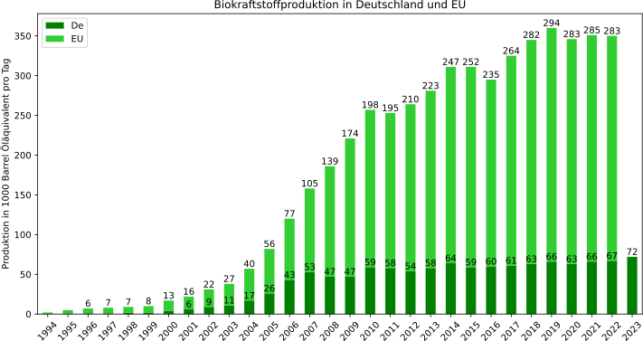

# Produktion von Biokraftstoffen in Deutschland und der EU in den Jahren 1994 bis 2023

Deutschland 1995 - 2023
> Energy Institute. (20. Juni, 2024). Produktion von Biokraftstoffen in Deutschland in den Jahren 1995 bis 2023 (in 1.000 Barrel Öläquivalent pro Tag) [Graph]. In Statista. Zugriff am 04. Juli 2024, von https://de.statista.com/statistik/daten/studie/198843/umfrage/produktion-von-biokraftstoffen-von-deutschland-in-oelaequivalent-seit-2000/

EU 1994 - 2022
> BP. (26. Juni, 2023). Produktion von Biokraftstoffen in der Europäischen Union in den Jahren 1994 bis 2022 (in 1.000 Barrel Öläquivalent pro Tag) [Graph]. In Statista. Zugriff am 04. Juli 2024, von https://de.statista.com/statistik/daten/studie/198874/umfrage/produktion-von-biokraftstoffen-der-europaeischen-union-in-oelaequivalent-seit-2000/

